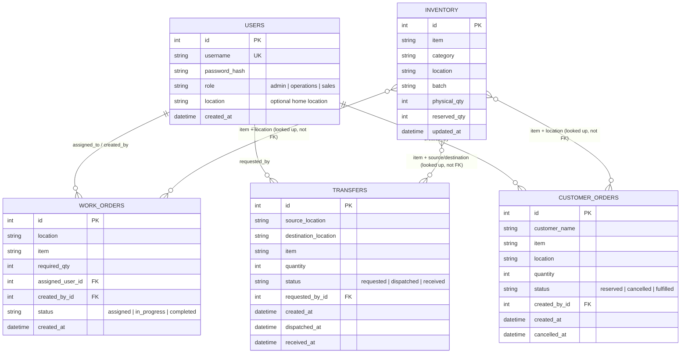

# Database Schema / ER Diagram

## Notes on the design

- `inventory` is keyed by the natural combination of **(item, location, batch)**
  — enforced with a unique constraint — rather than by a synthetic
  "SKU" table, since the case study's minimum fields don't call for a
  separate item master. `available_qty` is never stored; it's always
  `physical_qty - reserved_qty`, computed on read, so it can never drift out
  of sync.
- `work_orders`, `transfers`, and `customer_orders` reference inventory by
  `(item, location)` rather than a foreign key to a single `inventory.id`,
  because a work order or transfer can be satisfied across more than one
  batch at the same location. This keeps batch-level detail in `inventory`
  without forcing every other table to know about batches.
- Two `CHECK` constraints on `inventory` (`reserved_qty >= 0` and
  `reserved_qty <= physical_qty`) provide a database-level backstop against
  negative or over-reserved stock, on top of the application-level checks.
- Every status transition (`dispatch`, `receive`, `cancel`) is implemented as
  an atomic `UPDATE ... WHERE status = <expected>` — see
  [`API.md`](./API.md#concurrency--transaction-notes) for why this is what
  makes the concurrency requirements (Tests 1–4) hold up under load.
